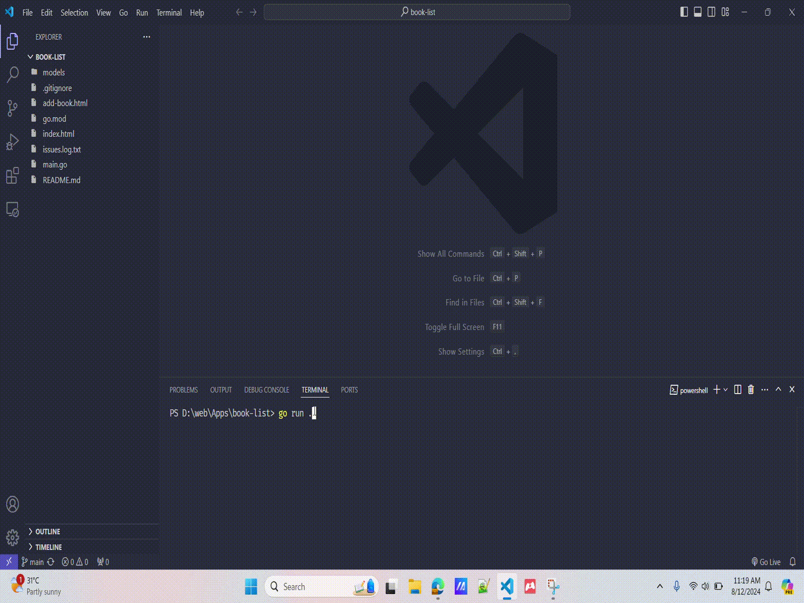

# Book List
- A todo list like website made using HTMX + Go + Bootstrap

# How to run the project
```shell
Pre-requisites 
- Golang Compiler must be installed in your machine (that is it)

# If u have the compiler installed then do the below command
`go run .`

# Other ways to run this program is to download the following binary in the releases tab and then execute the binary in your machine 
# I reccommend that you download the latest binary release in the repo
# If You feel like no installing the Executable, Feel free to see the below demo of this code
```

# Demo
- Note: [Work In Progress Build...]
